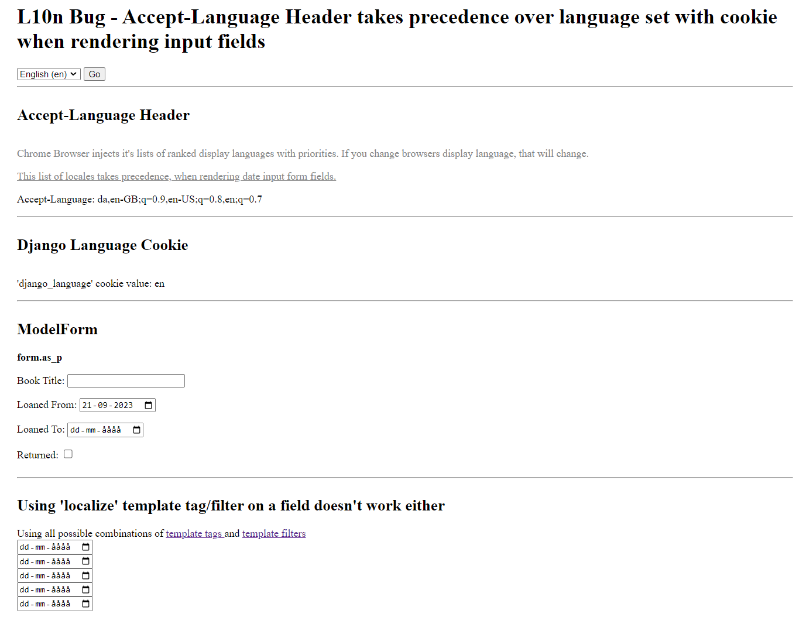

# L10n Bug
*Accept-Language Header takes precedence over language set with cookie when rendering date input form fields*

This is a minimal example of a previously submitted bug - the original issue can be found here: https://code.djangoproject.com/ticket/34853

In the image below, the language and locale is set to **en-US** but the form fields are localized to **da_DK**. The docs make no mention that this should be the expected behaviour. I also show that output localizations, such as times and dates strings are localized properly as they should (see green text in images).

- da_DK uses a dateformat of dd-MM-yyyy
- en_US uses a dateformat of mm/dd/yyyy

## en_US
This is where the bug is visible.


## da_DK
This shows up correct, as my browsers locale is the same as the django language.


## settings.py
```python

USE_TZ = True
TIME_ZONE = 'UTC'

LANGUAGE_CODE = 'en-us'
USE_I18N = True
LANGUAGE_COOKIE_AGE = 31_536_000

USE_L10N = True
USE_THOUSAND_SEPARATOR = True

LANGUAGES = [
    ('en-US', _('English')),
    ('da-DK', _('Danish')),
]
LOCALE_PATHS = [
    BASE_DIR / 'locale/',
]

```
## Model
```python
from django.db import models
from django.utils import timezone


class Book(models.Model):
    title = models.CharField(
        blank=False,
        null=False,
        max_length=60
    )
    borrowed_from_date = models.DateField(
        default=datetime.date.today(),
        blank=False,
        null=False,
    )
    borrowed_to_date = models.DateField(
        blank=False,
        null=False,
    )
    is_returned = models.BooleanField(
        default=False,
        blank=True,
        null=False,
    )

    class Meta:
        managed = True
        db_table = "book"

```

## ModelForm
```python
from django import forms
from django.forms import ModelForm
from django.utils.translation import gettext_lazy as _

from book_store.models import Book


class BookForm(ModelForm):
    def __init__(self, *args, **kwargs):
        super().__init__(*args, **kwargs)

    class Meta:
        model = Book
        localized_fields = (
            "borrowed_from_date",
            "borrowed_to_date",
        )
        fields = [
            "title",
            "borrowed_from_date",
            "borrowed_to_date",
            "is_returned"
        ]
        labels = {
            "title": _("Book Title"),
            "borrowed_from_date": _("Loaned From"),
            "borrowed_to_date": _("Loaned To"),
            "is_returned": _("Returned"),
        }
        widgets = {
            "title": forms.TextInput(attrs={"rows": 4}),
            "borrowed_from_date": forms.DateInput(attrs={"type": "date"}),
            "borrowed_to_date": forms.DateInput(attrs={"type": "date"}),
            "is_returned": forms.CheckboxInput(),
        }

```

## Form template tag/filter localization
```html
    <span>
      {{ form.borrowed_to_date }}
    </span>

    <span>
      {{ form.borrowed_to_date|localize }}
    </span>

    <span>
      
        {{ form.borrowed_to_date }}
      
    </span>

    <span>
      
        {{ form.borrowed_to_date }}
      
    </span>

    <span>
      
        {{ form.borrowed_to_date }}
      
    </span>
```